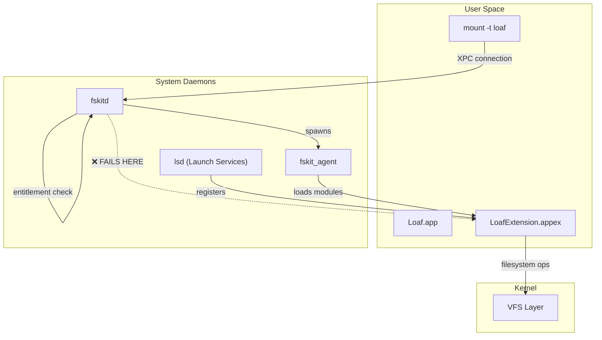
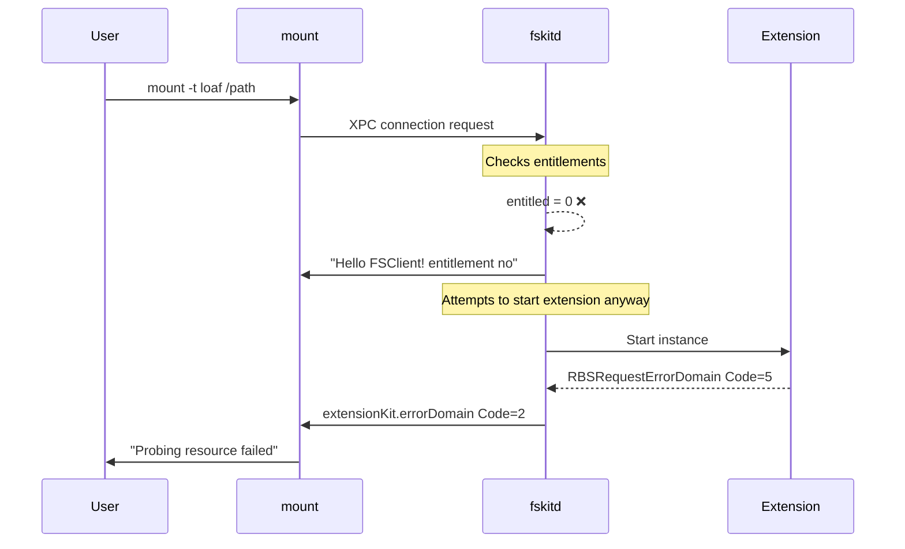
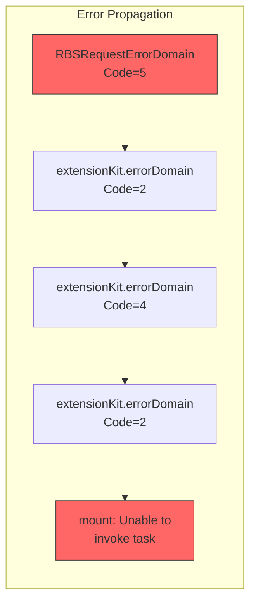
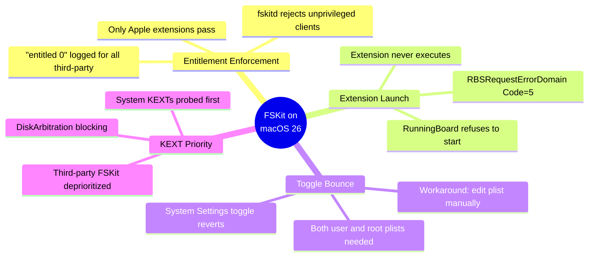
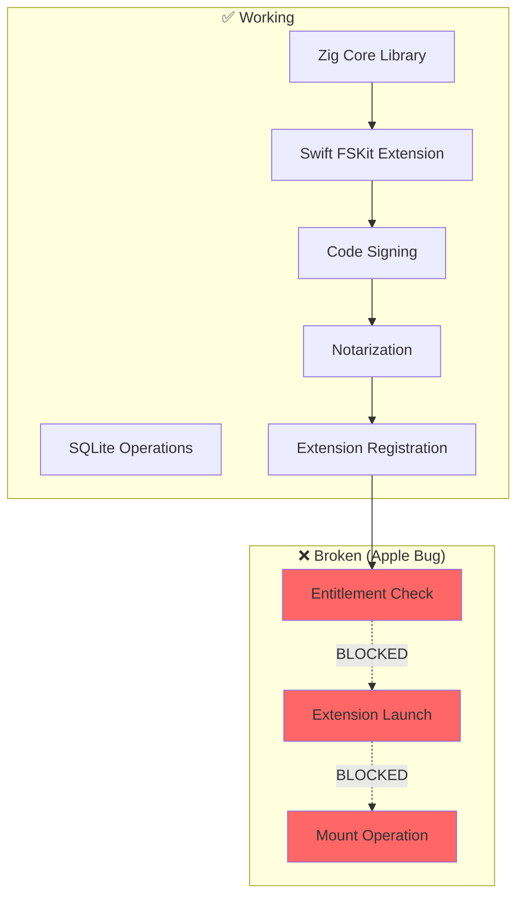

# FSKit Issues on macOS 26

## Current Status

**FSKit third-party extensions do not work on macOS 26.** This is an Apple bug, not a Loaf issue.

| macOS Version | Build | Status |
|--------------|-------|--------|
| 26.2 | 25C56 | ❌ Broken |
| 26.1 | 25B78 | ❌ Broken |

## Architecture Overview



## The Failure Point



## Error Chain



## What's Broken



## Components Status



## Log Evidence

```
fskitd: [com.apple.FSKit:default] Incomming connection, entitled 0
fskitd: [com.apple.FSKit:default] Hello FSClient! entitlement no
fskitd: [com.apple.FSKit:default] About to get current agent for 501
fskitd: [com.apple.FSKit:default] Failed to start instance <private>:
  Error Domain=com.apple.extensionKit.errorDomain Code=2
  UserInfo={NSUnderlyingError=... RBSRequestErrorDomain Code=5 ...}
```

## Apple Feedback Reports

| Feedback ID | Issue | Status |
|------------|-------|--------|
| FB18230524 | System NTFS driver blocking FSKit modules | Open |
| FB17772372 | Probing issues | Partially fixed in 15.6 beta |

## References

- [FSKit module mount fails with permissions](https://developer.apple.com/forums/thread/788609)
- [FSKit Sandbox restrictions](https://developer.apple.com/forums/thread/808246)
- [Cryptomator FSKit support issue](https://github.com/cryptomator/cryptomator/issues/3583)
- [macFUSE FSKit issue](https://github.com/macfuse/macfuse/issues/1025)

## Workarounds Attempted

All of these do NOT fix the issue:

1. ✅ Developer ID signing
2. ✅ Apple notarization
3. ✅ Hardened runtime
4. ✅ FSKit entitlements
5. ✅ Library validation disabled
6. ✅ Embedded dylib in extension
7. ✅ Manual plist enablement
8. ✅ fskitd restart
9. ❌ Static linking (breaks notarization)

## Conclusion

We are blocked waiting for Apple to fix FSKit. Per DTS engineer Kevin Elliott (July 2025):

> "Unfortunately, more bugs have been found so you're going to need to wait for more fixes."
