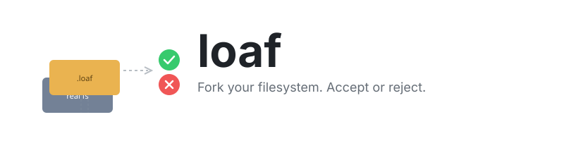

<p align="center">
  
</p>

<p align="center">
  <code>cargo install --git https://github.com/andrewgazelka/loaf && loaf run claude</code>
</p>

Overlay filesystem for macOS. Let AI modify your codebase freely, then accept or reject changes.

## How It Works

```
┌─────────────────────────────────────┐
│        Your commands / AI           │
├─────────────────────────────────────┤
│     Seatbelt Sandbox                │  ← Blocks direct writes to project
├─────────────────────────────────────┤
│     NFS Server (userspace)          │  ← Intercepts all ops
├─────────────────────────────────────┤
│     SQLite overlay (.loaf)          │  ← All writes go here
├─────────────────────────────────────┤
│     Real filesystem (untouched)     │  ← Reads pass through
└─────────────────────────────────────┘
```

**Two layers of protection:**
1. **NFS overlay** - Copy-on-write semantics, all project modifications stored in SQLite
2. **Seatbelt sandbox** - Prevents bypassing overlay via absolute paths to project directory

## Usage

```bash
cd ~/Projects/myapp
loaf run claude --dangerously-skip-permissions
```

When done, review the diff and choose: **y** to apply, **n** to discard.

```bash
loaf run <cmd> [args...]    # Run in sandbox
loaf run --no-sandbox <cmd> # Run without process sandbox (debugging)
loaf diff                   # Show pending changes
loaf accept                 # Apply changes
loaf reject                 # Discard changes
```

## Use Cases

- **AI agents**: Let Claude/GPT modify your project freely, review before applying
- **Safe experiments**: Project changes are captured, can be accepted or rejected
- **Package testing**: See what `npm install` actually touches in your project

## Sandbox

The process sandbox uses macOS Seatbelt to prevent bypassing the overlay:

| Location | Read | Write |
|----------|------|-------|
| Project directory | ✓ | ✗ (must use overlay) |
| Everything else | ✓ | ✓ |

The overlay captures writes via NFS. The sandbox blocks direct writes to the project directory, forcing all modifications through the overlay.

**Debug mode:** Set `LOAF_SANDBOX_DEBUG=1` to log denied operations:
```bash
LOAF_SANDBOX_DEBUG=1 loaf run bash
# In another terminal: log stream --predicate 'process == "sandboxd"'
```

## Status

Works via NFS userspace server. FSKit approach [blocked by Apple bugs](ISSUES.md).

---

<details>
<summary>Building from source</summary>

```bash
cargo build --release
```

Requires macOS 15+ and Rust 1.85+.

</details>
